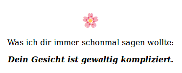

# balsam
generates compliment from a library consisting of
 *  nouns (plus information on male/female, singular/plural) (n=100)
 *  adjectivs (n=178)
 *  adverbs (n=44)
Rendering a total of 801000 possible combinations

also able to generate a html document with large list of precompiled compliments and a javascript button to fetch them one by one.

Is running on [balsam.camposcampos.de](balsam.camposcampos.de):

